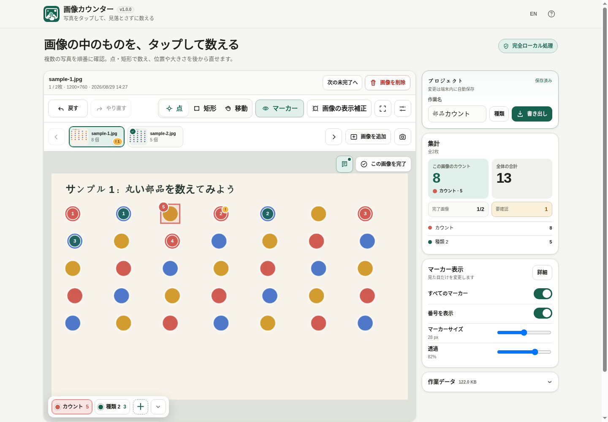

# 画像カウンター (Image Counter)

[](https://github.com/ttomohisa/htmlapps-image-counter/actions/workflows/deploy-pages.yml)
[](LICENSE)
[](https://ttomohisa.github.io/htmlapps-image-counter/)

[English README](README.md)

写真の中のものを、**自動認識ではなく自分でタップ / ドラッグして数える**ための単一HTMLアプリです。点・矩形のマーカーで「どこまで数えたか」を残し、迷った対象は要確認にして後から見直せます。選択した画像はアプリからサーバーへアップロードされません。

## 🚀 デモ

### [GitHub Pagesで画像カウンターを開く](https://ttomohisa.github.io/htmlapps-image-counter/)

GitHub Pagesから最初のHTMLを読み込んだ後、画像の読み込み、カウント、マーカー編集、カメラ処理、途中保存、画像補正、書き出しは端末内で処理されます。アプリで選択した画像がサーバーへ送信されることはありません。

[](https://ttomohisa.github.io/htmlapps-image-counter/)

## 主な機能

- **自分で数えるから、数えた場所が分かる** — 点をタップするか、対象を矩形で囲むと1個としてカウントします。
- **数えた後でも修正できる** — 点の移動、矩形の移動・四隅リサイズ、種類変更、削除、Undo / Redoに対応します。ポインター操作が中断された場合は追加を破棄し、移動・サイズ変更を元に戻します。Redo履歴も維持され、ピンチ操作へ切り替えた場合も未確定のマーカー編集は取り消されます。
- **画像を見たまま種類を切り替え** — Canvas下端の半透明ドックから1タップで切替。PCでは数字キー `1`〜`9` でも切り替えられます。邪魔なときはドックを小さくできます。
- **迷った対象は「要確認」へ** — 種類やカウント数を変えずに要確認フラグを付け、後から見直せます。要確認が残っている画像は完了にできません。
- **複数画像を順番に処理** — サムネイルや `←` / `→` で画像を移動し、画像ごとに完了状態を付けて「次の未完了」へ進めます。
- **見にくい画像を非破壊で補正** — 明るさ、コントラスト、白黒、90°回転を画像を見ながら調整でき、元画像は書き換えません。
- **カメラで撮影してそのまま作業** — 撮影後に確認し、撮り直し・採用・採用して次を撮影を選べます。
- **途中状態を端末内へ自動保存** — IndexedDBへ保存し、途中保存画像だけWebP圧縮することもできます。作業データ容量も確認できます。
- **使いやすい形で結果を書き出し** — 読み取り専用の単一HTMLビュワー、または `markers.csv` / `summary.csv` と任意のマーカー付きJPEGをまとめたZIPを保存できます。
- **閲覧HTMLからも結果を保存** — 画像切替、表示ON/OFF、画像情報・コメント確認、JPEG保存、CSV+JPEG ZIP保存に対応。画像カウンターへ読み戻せば編集を再開できます。
- **完全ローカルのランタイム** — アカウント、分析タグ、外部フォント、ランタイムCDN、画像アップロードはありません。CSPの `connect-src 'none'` で実行時通信を禁止しています。

## すぐに使う

### Webで使う

[GitHub Pagesのデモ](https://ttomohisa.github.io/htmlapps-image-counter/)を開くだけで利用できます。インストールやアカウント登録は不要です。

### 単一HTMLをダウンロードして使う

1. このリポジトリの `dist/index.html` をダウンロードします。
2. 最新のChromium系ブラウザー、Firefox、Safariで開きます。
3. 写真を追加してそのままカウントを始められます。通常利用ではローカルWebサーバーは不要です。

### 単一HTMLを再ビルドする（advanced）

1. このリポジトリをダウンロードまたはクローンします。
2. Windows 10/11で `build-standalone.bat` をダブルクリックします。
3. 通常版 `dist/index.html` が生成されます。
4. gzip自己展開版 `dist/index.self-extract.html` も同時に生成されます。

v1.0.0は外部ランタイムライブラリを使っていないため、ビルド時にブラウザー用ライブラリをダウンロードする必要はありません。

## 使い方

1. JPG / JPEG / PNG / WebP画像を1枚以上追加するか、カメラで撮影します。
2. **点 / 矩形 / 移動**から操作モードを選びます。
3. Canvas下端の半透明ドックから、現在数える種類を選びます。PCでは `1`〜`9` キーでも切り替えられます。
4. 点モードでは対象を1回タップ / クリック、矩形モードでは対象を囲むようにドラッグします。
5. 修正するときだけ既存マーカーを選択します。点は移動、矩形は移動と四隅リサイズができます。
6. 判断に迷った対象は旗ボタンで **要確認** にします。要確認をすべて解除するまで、その画像を完了にはできません。
7. Canvas右上の「完了」横にあるメモボタンから画像メモを追加できます。PCではCanvas内のメモパネルをドラッグ移動でき、スマホではCanvas直下に表示します。
8. 画像が終わったら「完了」にして、次の未完了画像へ進むか、サムネイル / 左右キーで画像を切り替えます。
9. 「書き出し」から閲覧HTML、または集計ZIPを保存します。「マーカー付きJPEGを含める」をオフにするとCSV 2ファイルだけを書き出せます。

### キーボード操作

| ショートカット | 操作 |
| --- | --- |
| `1`〜`9` | 対応するカウント種類へ切り替え |
| `←` / `→` | 前 / 次の画像へ移動 |
| `Ctrl` / `⌘` + `Z` | 元に戻す |
| `Ctrl` / `⌘` + `Shift` + `Z` | やり直す |

入力欄への入力中やダイアログ表示中は、左右キーによる画像切り替えを行いません。

## カウントと要確認

### 点 / 矩形マーカー

通常は点マーカーが手早く使えます。対象が密集している、小さい、輪郭を残した方が後から確認しやすい場合は矩形が便利です。マーカー上の番号は**種類ごとに1から**振られ、画像全体・プロジェクト全体の合計は別に保持します。

### 要確認

**要確認**は通常マーカーに重ねて付けるフラグです。別の種類にはならず、カウント数も変わりません。要確認中は黄色い `!` が付き、画像一覧や集計でも残数を確認できます。

要確認が1つでも残っている画像は完了にできません。

### 画像の表示補正

暗い写真や見づらい写真では「画像の表示補正」を開き、画像を見たまま以下を調整できます。

- 明るさ
- コントラスト
- 白黒の強さ
- 90°回転

元画像自体は上書きしません。

## 閲覧HTML

閲覧HTMLは、**結果を確認・共有するための読み取り専用ビュワー**です。編集画面をそのまま保存する形式ではありません。

以下を確認・操作できます。

- プロジェクト全体の合計、完了画像数、要確認件数
- 種類別集計
- サムネイル / 前へ・次へ / `←`・`→` による画像移動
- 点・矩形マーカーと種類ごとの番号
- マーカー / 番号 / 種類別表示のON/OFF
- ファイル名、撮影日時と取得元、画像サイズ、元形式/容量、完了状態、件数、要確認件数を整理した画像情報
- SVGアイコン付きの独立した **「コメント」** 欄
- 現在画像のマーカー付きJPEG保存
- CSV + 全画像JPEGのZIP保存

閲覧HTML内の保存操作には確認ダイアログが入ります。

続きを編集する場合は、画像カウンター本体の **「閲覧HTMLを読み込む」** からHTMLを読み込むと編集状態へ復元できます。

## 出力ファイル

### CSV + 任意のマーカー付き画像ZIP

編集画面の「マーカー付きJPEGを含める」は初期状態でオンです。オフにすると画像の読み込み・描画を行わず、`markers.csv` と `summary.csv` だけをZIPに保存します。選択はページを再読み込みするまで保持され、作業データには保存されません。CSVの内容と編集可能なZIPファイル名はどちらのモードでも共通です。閲覧HTMLからのZIP保存には従来どおりJPEGも含まれます。

初期設定の内容:

```text
result.zip
├─ markers.csv
├─ summary.csv
└─ images/
   ├─ 01-counted-....jpg
   └─ 02-counted-....jpg
```

`markers.csv` には画像情報、撮影日時 (`image_captured_at`) と日時の取得元 (`capture_time_source`)、表示補正、点/矩形、要確認状態、種類内番号、種類、正規化座標、px座標、矩形サイズなどを保存します。

`summary.csv` には画像・種類・プロジェクト単位の件数と `review_count` を保存します。

### 閲覧HTMLの画像圧縮

閲覧HTMLへ画像を埋め込む際は、必要に応じてWebPへ変換してファイルサイズを減らせます。CSV + 画像ZIPのマーカー付き画像はJPEGです。

## カメラと撮影日時

画像情報の撮影日時は、次の順で取得します。

1. JPEGにEXIF撮影日時がある場合はEXIFを優先
2. EXIF撮影日時がない場合は選択したファイルの日時
3. アプリ内カメラで撮影した場合は実際の撮影時刻

撮影日時と日時の取得元は、閲覧HTMLとCSVにも保持されます。

## 途中保存と容量

新しい写真・サンプル・閲覧HTMLを正常に読み込むと、前回の作業の復元案内は閉じます。ファイル選択をキャンセルした場合や読み込みに失敗した場合は、保存済みの作業を引き続き復元できます。復元案内の集計、操作の読み上げ名、ツールチップも日本語／英語の切り替えに追従します。

対応ブラウザーではプロジェクトをIndexedDBへ自動保存します。画面から以下を確認できます。

- 現在の作業データ容量
- 途中保存容量
- ブラウザーが提供する場合はストレージ空き容量

途中保存用の画像コピーだけをWebPへ変換して容量を減らすこともできます。論理的な画像サイズやマーカー座標は維持されます。

## GitHub Pagesで公開する

このリポジトリには、単一HTMLをビルドして `dist/` をGitHub Pagesへ公開するワークフローが含まれています。

1. リポジトリ名を `htmlapps-image-counter` としてGitHubへプッシュします。
2. **Settings → Pages → Build and deployment → Source** で **GitHub Actions** を選択します。
3. `main` へプッシュするか、Actionsから **Deploy standalone app to GitHub Pages** を手動実行します。
4. 成功後、`https://ttomohisa.github.io/htmlapps-image-counter/` で利用できます。

公開前にリポジトリ検証が実行されます。Pagesがまだ有効でない場合でもビルドは行われ、ActionsのSummaryに初回設定手順が表示されます。

## 開発とビルド

既定のビルドでは、配布用の `image-counter.html` も更新します。ソースの変更と一緒にこのファイルをコミットしてください。`-OutputPath` を指定したビルドはこのファイルを変更しません。Node.js 24 が利用できる環境で `scripts/check-repository.ps1` を実行すると、配布ファイルの同期とカメラの回帰テストを検証します。古い配布ファイルは上書きせず、エラーとして報告します。

生成済み `dist/index.html` は直接編集せず、`src/index.template.html` を変更してください。

```text
.
├─ src/index.template.html       # アプリ本体のテンプレート
├─ app.config.json               # アプリ名・バージョン・ビルド設定
├─ dependencies.json             # 内包依存一覧（現在は空）
├─ build-standalone.bat          # Windows用ビルド入口
├─ build-standalone.ps1          # 単一HTMLビルダー
├─ scripts/                      # 検証・自己展開版生成
├─ assets/                       # favicon / README用スクリーンショット
├─ dist/index.html               # 生成済み単一HTML
└─ .github/workflows/
   ├─ build-standalone.yml       # PR / 手動のビルド検証
   └─ deploy-pages.yml           # GitHub Pages公開
```

ビルド時には単一HTMLの検証、ビルド情報の生成、自己展開版の生成が行われます。

## プライバシーと通信防止

生成されたHTMLは、選択した画像を端末の外へ出さない構成です。

- Content Security Policyに `connect-src 'none'` を指定
- ランタイムCDN・外部フォントなし
- 分析タグ・テレメトリなし
- アカウント・バックエンドなし
- 画像やマーカーデータをアプリからアップロードしない
- カメラ映像はブラウザーのローカルメディアAPIで処理

GitHub Pages版では最初のHTML取得だけは通信します。ネットワークを完全に切って利用する場合は、`dist/index.html` をローカルで開いてください。

## 制限事項

- AI / 自動物体検出は意図的に行いません。
- 現在のUIでは1プロジェクト最大30枚です。
- 1画像35MB超は読み込まず、プロジェクト全体にも220MBの元画像データ上限ガードがあります。
- 高解像度画像を多数扱うと、端末メモリやブラウザーストレージを多く消費します。
- ライブカメラはブラウザー権限やSecure Contextの条件に依存します。利用できない場合は端末カメラ / ファイル入力へフォールバックします。
- EXIF撮影日時の読み取りは主にJPEGを対象とし、その他の形式では通常ファイル日時を使用します。
- v1.0.0ではExcel (`.xlsx`) 出力に対応していません。

## 使用ライブラリ

画像カウンター v1.0.0は、**サードパーティーのランタイムライブラリを内包していません**。ブラウザーAPI、Canvas、IndexedDB、Pointer Events、システムフォントで実装しています。詳細は [THIRD_PARTY_NOTICES.md](THIRD_PARTY_NOTICES.md) を確認してください。

## コントリビューション

バグ報告や機能提案はGitHub Issuesからお願いします。開発への参加方法は [CONTRIBUTING.md](CONTRIBUTING.md) を確認してください。

## ライセンス

Copyright © 2026 ttomohisa

このプロジェクトは [MIT License](LICENSE) で公開されています。

カメラ画面を閉じると撮影を停止します。起動待ちのカメラも、取得完了後に停止します。
