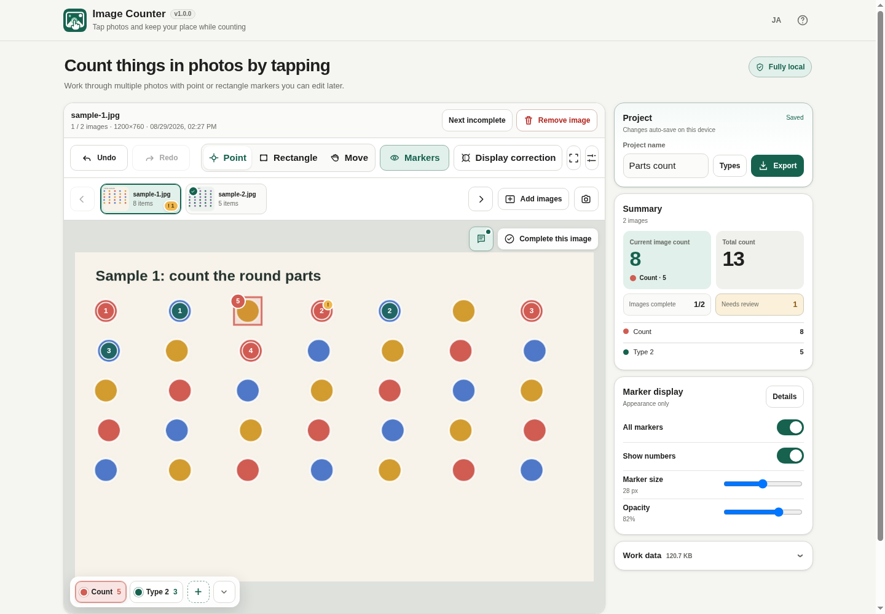

# Image Counter

[](https://github.com/ttomohisa/htmlapps-image-counter/actions/workflows/deploy-pages.yml)
[](LICENSE)
[](https://ttomohisa.github.io/htmlapps-image-counter/)

[日本語版 README](README.ja.md)

A privacy-focused, single-HTML app for **manually counting objects in photos**. Place point or rectangle markers yourself, keep track of what has already been counted, flag uncertain items for review, and export the result without uploading your images to a server.

## 🚀 Live demo

### [Open Image Counter on GitHub Pages](https://ttomohisa.github.io/htmlapps-image-counter/)

GitHub Pages delivers the initial HTML. After it loads, image decoding, counting, marker editing, camera handling, autosave, image correction, and export are processed locally on your device. Images selected in the app are not uploaded by the app.

[](https://ttomohisa.github.io/htmlapps-image-counter/)

## Features

- **Count manually, without losing your place** — Tap to place point markers or drag rectangles around objects. Each marker is one count.
- **Correct mistakes after counting** — Move point markers, move or resize rectangles, change the marker type, delete a marker, and use Undo / Redo.
- **Switch counting types directly on the image** — Use the translucent type dock on the canvas, or number keys `1`–`9` on desktop. The dock can be minimized when it covers an object.
- **Flag uncertain items for later review** — Add an independent **Needs review** flag without changing the marker type or count. Images with unresolved review markers cannot be marked complete.
- **Work through multiple photos** — Add several images, move with thumbnails or `←` / `→`, mark each image complete, and jump to the next incomplete image.
- **Adjust hard-to-see photos without changing the original** — Brightness, contrast, grayscale, and 90° rotation are non-destructive and are preserved in exports.
- **Capture photos from the camera** — Review a capture before adding it, retake it, or accept it and continue shooting.
- **Keep drafts locally** — Autosave to IndexedDB, optionally compress draft image copies to WebP, and see the current project / draft storage size.
- **Export results in practical formats** — Save a read-only single-HTML viewer, or a ZIP containing `markers.csv`, `summary.csv`, and annotated JPEG images.
- **Share a viewer without giving up the data** — The exported viewer can switch images, toggle marker visibility, show image information and comments, and re-export JPEG / CSV+JPEG ZIP. Import it back into Image Counter to resume editing.
- **Private, dependency-free runtime** — No account, analytics, remote font, runtime CDN, or image upload. Runtime networking is blocked by CSP with `connect-src 'none'`.

## Quick start

### Use the web demo

Open the [GitHub Pages demo](https://ttomohisa.github.io/htmlapps-image-counter/). No installation or account is required.

### Use the standalone HTML

1. Download `dist/index.html` from this repository.
2. Open it in a current Chromium-based browser, Firefox, or Safari.
3. Add photos and start counting. No local web server is required for normal file-based use.

### Rebuild the single HTML (advanced)

1. Download or clone this repository.
2. On Windows 10/11, double-click `build-standalone.bat`.
3. Use the generated `dist/index.html` as the normal standalone app.
4. `dist/index.self-extract.html` is also generated as a gzip self-extracting variant.

This app currently has no third-party runtime dependencies, so the build does not need to download a browser library package.

## Usage

1. Add one or more JPG / JPEG / PNG / WebP images, or use the camera.
2. Choose **Point**, **Rectangle**, or **Move**.
3. Select the active counting type from the translucent dock along the bottom of the canvas. On desktop, keys `1`–`9` also switch types.
4. In Point mode, tap/click an object once. In Rectangle mode, drag around one object.
5. Select an existing marker only when it needs correction. Point markers can be moved; rectangles can be moved and resized from four corner handles.
6. Use the flag button to mark an uncertain marker as **Needs review**. Clear all review flags before completing the image.
7. Use the memo button beside **Complete** to add an image note. On desktop the memo panel can be dragged within the canvas; on mobile it opens below the canvas.
8. Mark the image complete, then move to the next incomplete image or switch images with thumbnails / arrow keys.
9. Export a Viewer HTML or a CSV + annotated JPEG ZIP.

### Keyboard shortcuts

| Shortcut | Action |
| --- | --- |
| `1`–`9` | Switch to the corresponding counting type |
| `←` / `→` | Move to the previous / next image |
| `Ctrl` / `⌘` + `Z` | Undo |
| `Ctrl` / `⌘` + `Shift` + `Z` | Redo |

Arrow-key image navigation is disabled while typing in an input field or while a modal dialog is open.

## Counting and review workflow

### Point and rectangle markers

Point markers are fast for ordinary counting. Rectangle markers are useful when the target is dense, small, or easier to identify by outlining it. Marker numbers restart from `1` for each counting type, while image and project totals are tracked separately.

### Needs review

**Needs review** is a flag layered on top of a normal marker. It does not create another marker type and does not change the count. Flagged markers show an amber `!` badge, and the remaining review count is visible in the image list and project summary.

An image cannot be marked complete while one or more review flags remain.

### Image display correction

Use **Display correction** when the source photo is dark or low-contrast. The correction panel stays out of the way so you can watch the image while adjusting:

- Brightness
- Contrast
- Grayscale amount
- 90° rotation

The original source image is not overwritten.

## Read-only viewer HTML

Viewer HTML is intended for **reviewing and sharing the count result**, not editing it.

It includes:

- project total, completion, and needs-review summary
- per-type totals
- thumbnails plus Previous / Next / `←` / `→` navigation
- annotated point / rectangle markers with per-type numbering
- marker, number, and per-type visibility controls
- structured image information: filename, captured time/source, dimensions, original format/size, completion state, count, and needs-review count
- a dedicated **Comment** card for the image note
- current annotated JPEG download
- CSV + all annotated JPEG images ZIP download

Viewer-side downloads show a confirmation dialog before the file is saved.

To edit again, import the viewer HTML with **Import viewer HTML** in Image Counter.

## Export files

### CSV + annotated image ZIP

```text
result.zip
├─ markers.csv
├─ summary.csv
└─ images/
   ├─ 01-counted-....jpg
   └─ 02-counted-....jpg
```

`markers.csv` contains image metadata, captured time (`image_captured_at`) and its source (`capture_time_source`), display corrections, point/rectangle shape, needs-review state, per-type numbering, category information, normalized coordinates, pixel coordinates, and rectangle dimensions.

`summary.csv` contains per-image, per-type, and project-level counts, including `review_count`.

### Viewer HTML image compression

When exporting Viewer HTML, embedded images can optionally be converted to WebP to reduce the file size. Annotated images in CSV + image ZIP exports remain JPEG.

## Camera and captured time

For image metadata, Image Counter uses:

1. JPEG EXIF capture time when available (`DateTimeOriginal` / related EXIF date fields)
2. the selected file timestamp when EXIF capture time is unavailable
3. the actual capture time for photos taken through the in-app camera

The captured time and its source are preserved in Viewer HTML and CSV exports.

## Local draft storage

Projects are autosaved to IndexedDB on supported browsers. The app can show:

- current project data size
- saved draft size
- available browser storage when the browser exposes it

Draft image copies can be converted to WebP to reduce local storage usage. This compression applies to the autosaved copy; logical image dimensions and marker coordinates are preserved.

## Publish with GitHub Pages

The repository includes a workflow that builds the standalone HTML and deploys `dist/` to GitHub Pages.

1. Push the repository to GitHub as `htmlapps-image-counter`.
2. Open **Settings → Pages → Build and deployment → Source** and select **GitHub Actions**.
3. Push to `main`, or manually run **Deploy standalone app to GitHub Pages** from the Actions tab.
4. After a successful deployment, the app is available at `https://ttomohisa.github.io/htmlapps-image-counter/`.

The workflow runs the repository checks before publishing. If Pages is not enabled yet, the build still runs and the workflow summary explains the one-time setup step.

## Development and build layout

Edit `src/index.template.html`, not the generated `dist/index.html`.

```text
.
├─ src/index.template.html       # Application source template
├─ app.config.json               # App identity and build settings
├─ dependencies.json             # Embedded runtime dependency list (currently empty)
├─ build-standalone.bat          # Windows build entry point
├─ build-standalone.ps1          # Standalone HTML builder
├─ scripts/                      # Verification and self-extract build scripts
├─ assets/                       # Favicon and README screenshots
├─ dist/index.html               # Generated standalone app
└─ .github/workflows/
   ├─ build-standalone.yml       # Pull request / manual validation
   └─ deploy-pages.yml           # GitHub Pages deployment
```

The build process verifies the generated single HTML, creates build manifests, and creates the optional self-extracting HTML variant.

## Privacy and runtime network protection

The generated HTML is designed to keep selected images on the device:

- Content Security Policy includes `connect-src 'none'`
- no runtime CDN or remote font
- no analytics or telemetry
- no account or backend
- image files and marker data are not uploaded by the app
- camera frames are handled by local browser media APIs

The GitHub Pages version still requires the initial HTML request. For use with the network completely disconnected, open `dist/index.html` locally.

## Limitations

- This app intentionally does **not** perform AI / automatic object detection.
- One project supports up to 30 images in the current UI.
- Individual images over 35 MB are rejected, and the project has a 220 MB source-data guard.
- Large or high-resolution multi-image projects can consume substantial device memory and browser storage.
- Live camera availability depends on browser permissions and secure-context behavior. Device camera / file-input fallback remains available.
- Capture-time EXIF extraction is focused on JPEG metadata; other formats generally use the source file timestamp.
- XLSX export is not included in v1.0.0.

## Dependencies

Image Counter v1.0.0 bundles **no third-party runtime libraries**. It uses browser APIs, Canvas, IndexedDB, Pointer Events, and system fonts. See [THIRD_PARTY_NOTICES.md](THIRD_PARTY_NOTICES.md).

## Contributing

Bug reports and feature proposals are welcome through GitHub Issues. See [CONTRIBUTING.md](CONTRIBUTING.md) for development guidance.

## License

Copyright © 2026 ttomohisa

Licensed under the [MIT License](LICENSE).
